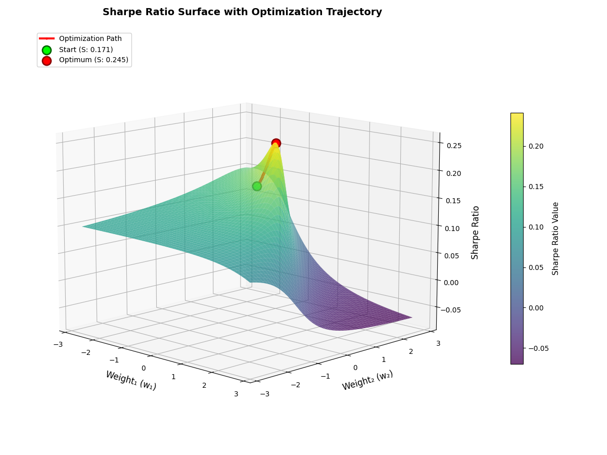
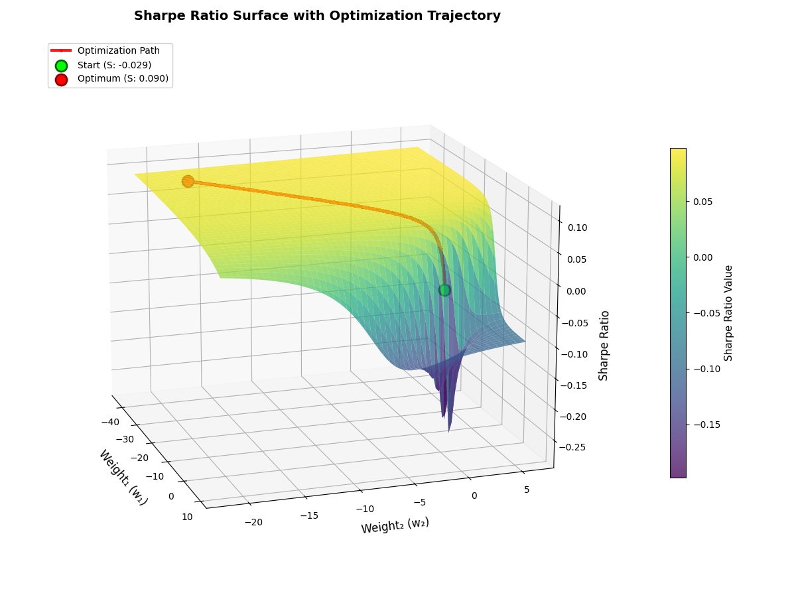

# Trabajo práctico 1 - Nicolás Baranowski

## How to run

- Seteamos qué stocks queremos analizar.
- Seteamos qué cantidades/porcentajes queremos de cada stock en nuestro portafolio. La únicas consideraciones que debemos tener es que la suma de cantidades/porcentajes sea distinto de 0.  
- Seteamos la Risk Free Rate. En este ejemplo usamos una Risk Free Rate de 0.25% mensual.  


```python
config = {
    "stocks": ["AAPL", "MSFT", "GOOG"],
    "initialWeights": np.array([0.1, 0.6, -0.1]), 
    "riskFreeRate": 0.0025 
}
```
Una vez cambiados los parámetros, estamos listos para correr el script. Lo que debemos hacer es:
- Obtener los precios para un período de tiempo elegido de todos los stocks.
- Calcular el cambio porcentual de dichos retornos.
- Calcular el promedio de retornos.
- Calcular la matriz de covarianzas de los activos elegidos.

```python
precios = yf.download(config["stocks"], period="5y", interval="1mo") 
returns = precios['Close'].pct_change()[1:]  

expected_returns = returns.mean().to_numpy() 
cov_matrix = returns.cov().to_numpy()
```

Una vez hecho todo esto, podemos arrancar.

## Punto 1 - Implementación base

Dados unos weights, retornos esperados, matriz de covarianzas y risk free rate, calculamos el ratio de Sharpe.

```python
sharpeRatio = sharpeRatio(config["initialWeights"],
                          expected_returns,
                          cov_matrix,
                          config["riskFreeRate"])
```

Una vez encontrado el Ratio de Sharpe, podemos encontrar el gradiente del mismo mediante la aplicación de derivadas numéricas centradas.  

```python
gradient = sharpeRatioGradient(config["initialWeights"],
                               expected_returns,
                               cov_matrix,
                               config["riskFreeRate"],
                               error=1e-6)
```

Esta función se aprovecha de `sharpeRatio()` para calcular la derivada numérica centrada. 


## Punto 2 - Descenso por gradiente simple.
El objetivo es poder maximizar el Ratio de Sharpe mediante el método de descenso por gradiente y la utilización de la derivada numérica centrada.  

```python
maxSharpe = maxSharpeRatio(config["initialWeights"],
                           expected_returns,
                           cov_matrix,
                           config["riskFreeRate"],
                           learning_rate=0.0001,
                           max_iterations=1000000,
                           tolerance=1e-9,
                           allow_short=True)
```

Los nuevos parámetros que le pasamos a esta función son:
- `learning_rate`: tamaño del paso para ir en la dirección de máximo crecimiento de la función.
- `max_iterations`: número máximo de iteraciones permitidas para encontrar el máximo ratio de sharpe.
- `tolerance`: mejora mínima necesaria en el ratio de Sharpe para frenar la búsqueda.
- `allow_short`: de ser verdadero, se admiten pesos negativos en el portafolio. En caso de ser falso, no.  

Esta función crea un historial de ratios de Sharpe y de los weights usados. Calcula de manera iterativa ratios de Sharpe ajustando levemente los weights del portafolio moviéndose en la dirección del gradiente, con el fin de moverse en la dirección de máximo crecimiento y llegar a un punto en el que no se puede mejorar el ratio. 

## Punto 3 - Maximización Long-Only

La idea es la mísma que el punto anterior, pero asumiendo que nos encontramos en un mercado que no permite short-selling. Para esto, utilizamos la misma función del punto anterior.

```python
maxSharpe = maxSharpeRatio(config["initialWeights"],
                           expected_returns,
                           cov_matrix,
                           config["riskFreeRate"],
                           learning_rate=0.0001,
                           max_iterations=1000000,
                           tolerance=1e-9,
                           allow_short=False)
```

La única diferencia es que ahora nos aseguramos de pasar por parámetro `allow_short = False`.  
De esta forma, cada vez que se quiere shortear un acitvo, se le asigna directamente 0 tanto a su respectivo weight como a su derivada parcial, para evitar que siga queriendo moverse en una dirección no permitida por el gradiente negativo.  

## Punto 4 - Análisis gráfico

La idea es tomar 3 activos y graficar las curvas de nivel del ratio de Sharpe para 2 weights, y construir el tercero a partir de estos últimos.  
```python
plot_results = plotSharpeOptimization(config["initialWeights"],
                       expected_returns,
                       cov_matrix, 
                       config["riskFreeRate"],
                       learning_rate=0.0001,
                       max_iterations=10000000,
                       tolerance=1e-9,
                       allow_short=False,
                       resolution=100)
```
El único parámetro nuevo que tenemos ahora es:
- `resolution`: indica el tamaño de la grilla para hacer el plot, mejorando la resolución.    

Esta función, además de graficar en 3D todas las combinaciones de activos posibles y su ratio de Sharpe correspondiente, nos devuelve la información alcanzada luego de la maximización.

## Resultados alcanzados
### Punto 1
Para la siguiente lista de stocks y weights, buscamos el ratio de sharpe y su gradiente.

```python
config = {
    "stocks": ["AAPL", "MSFT", "GOOG", "TSLA", "GGAL", "AMZN"], #List of stocks on the portafolio. 
    "initialWeights": np.array([0.1, 0.6, -0.1, 0.4, 0.2, 0.3]), #Weight of every stock on the portfolio. Numpy array
    "riskFreeRate": 0.0025 #monthly risk-free rate, as expected returns are also monthly
}
```
```python
sharpe_ratio = sharpeRatio(config["initialWeights"],
                          expected_returns,
                          cov_matrix,
                          config["riskFreeRate"])

gradient = sharpeRatioGradient(config["initialWeights"],
                               expected_returns,
                               cov_matrix,
                               config["riskFreeRate"],
                               error=1e-9)

print(f"Initial Sharpe Ratio: {sharpe_ratio:.6f}")
print(f"Initial Gradient: {gradient}")
```

```
Initial Sharpe Ratio: 0.159380
Initial Gradient: [ 0.03717535 -0.03985096  0.31225421  0.07564928  0.06280652  0.02865813]
```

### Punto 2
Para la siguiente lista de stocks y weights, maximizamos el ratio de Sharpe modificando los weights, permitiendo short-selling.
```python
config = {
    "stocks": ["AAPL", "MSFT", "GOOG"], #List of stocks on the portafolio. 
    "initialWeights": np.array([0.3, 0.3, 0.4]), #Weight of every stock on the portfolio. Numpy array
    "riskFreeRate": 0.0025 #monthly risk-free rate, as expected returns are also monthly
}
```

```python
sharpe_ratio = sharpeRatio(config["initialWeights"],
                          expected_returns,
                          cov_matrix,
                          config["riskFreeRate"])

max_sharpe = maxSharpeRatio(config["initialWeights"],
                           expected_returns,
                           cov_matrix,
                           config["riskFreeRate"],
                           learning_rate=0.0001,
                           max_iterations=1000000,
                           tolerance=1e-9,
                           allow_short=True)

print("Initial Weights: ", config["initialWeights"])
print(f"Initial Sharpe Ratio: {sharpe_ratio:.6f}")
print(f"Optimal Weights: {max_sharpe['optimal_weights']}")
print(f"Optimal Sharpe Ratio: {max_sharpe['optimal_sharpe']:.6f}")
print(f"Weights Sum Verification: {np.sum(max_sharpe['optimal_weights']):.8f}")
```

```
Initial Weights:  [0.3 0.3 0.4]
Initial Sharpe Ratio: 0.265437
Optimal Weights: [0.14318049 0.42805853 0.42876098]
Optimal Sharpe Ratio: 0.271234
Weights Sum Verification: 1.00000000
```
Otro ejemplo con más activos y distintos weights

```python
config = {
    "stocks": ["AAPL", "MSFT", "GOOG", "TSLA", "GGAL", "AMZN"], #List of stocks on the portafolio. 
    "initialWeights": np.array([0.1, 0.6, -0.1, 0.4, 0.2, 0.3]), #Weight of every stock on the portfolio. Numpy array
    "riskFreeRate": 0.0025 #monthly risk-free rate, as expected returns are also monthly
}
```

```python
sharpe_ratio = sharpeRatio(config["initialWeights"],
                          expected_returns,
                          cov_matrix,
                          config["riskFreeRate"])

max_sharpe = maxSharpeRatio(config["initialWeights"],
                           expected_returns,
                           cov_matrix,
                           config["riskFreeRate"],
                           learning_rate=0.0001,
                           max_iterations=1000000,
                           tolerance=1e-9,
                           allow_short=True)

print("Initial Weights: ", config["initialWeights"])
print(f"Initial Sharpe Ratio: {sharpe_ratio:.6f}")
print(f"Optimal Weights: {max_sharpe['optimal_weights']}")
print(f"Optimal Sharpe Ratio: {max_sharpe['optimal_sharpe']:.6f}")
print(f"Weights Sum Verification: {np.sum(max_sharpe['optimal_weights']):.8f}")
```

```
Initial Weights:  [ 0.1  0.6 -0.1  0.4  0.2  0.3]
Initial Sharpe Ratio: 0.159380
Optimal Weights: [ 0.1955341  -0.80270818  0.25937388  0.62304312  0.64629182  0.07846526]
Optimal Sharpe Ratio: 0.404857
Weights Sum Verification: 1.00000000
```

### Punto 3
Para la siguiente lista de stocks y weights, maximizamos el ratio de Sharpe modificando los weights, sin permitir short-selling.

```python
config = {
    "stocks": ["AAPL", "MSFT", "GOOG", "TSLA", "GGAL", "AMZN"], #List of stocks on the portafolio. 
    "initialWeights": np.array([0.1, 0.6, -0.1, 0.4, 0.2, 0.3]), #Weight of every stock on the portfolio. Numpy array
    "riskFreeRate": 0.0025 #monthly risk-free rate, as expected returns are also monthly
}
```

```python
sharpe_ratio = sharpeRatio(config["initialWeights"],
                          expected_returns,
                          cov_matrix,
                          config["riskFreeRate"])

max_sharpe = maxSharpeRatio(config["initialWeights"],
                           expected_returns,
                           cov_matrix,
                           config["riskFreeRate"],
                           learning_rate=0.0001,
                           max_iterations=1000000,
                           tolerance=1e-9,
                           allow_short=False)

print("Initial Weights: ", config["initialWeights"])
print(f"Initial Sharpe Ratio: {sharpe_ratio:.6f}")
print(f"Optimal Weights: {max_sharpe['optimal_weights']}")
print(f"Optimal Sharpe Ratio: {max_sharpe['optimal_sharpe']:.6f}")
print(f"Weights Sum Verification: {np.sum(max_sharpe['optimal_weights']):.8f}")
```

```
Initial Weights:  [ 0.1  0.6 -0.1  0.4  0.2  0.3]
Initial Sharpe Ratio: 0.159380
Optimal Weights: [0.03544968 0.         0.24054546 0.35458477 0.36942009 0.        ]
Optimal Sharpe Ratio: 0.337200
Weights Sum Verification: 1.00000000
```
Notar como ahora el weight que, antes era negativo, es 0

### Punto 4

Para la siguiente lista de stocks y weights, maximizamos el ratio de Sharpe modificando los weights, permitiendo short-selling y graficamos.

```python
config = {
    "stocks": ["AAPL", "MSFT", "TSLA"], #List of stocks on the portafolio. 
    "initialWeights": np.array([0.1, 0.2]), #Weight of every stock on the portfolio. Numpy array
    "riskFreeRate": 0.0025 #monthly risk-free rate, as expected returns are also monthly
}
```

```python
sharpe_ratio = sharpeRatio(config["initialWeights"],
                          expected_returns,
                          cov_matrix,
                          config["riskFreeRate"])

plot_results = plotSharpeOptimization(config["initialWeights"],
                       expected_returns,
                       cov_matrix, 
                       config["riskFreeRate"],
                       learning_rate=0.0001,
                       max_iterations=10000000,
                       tolerance=1e-9,
                       allow_short=True,
                       resolution=100)

print("Initial Weights: ", config["initialWeights"])
print(f"Initial Sharpe Ratio: {sharpe_ratio:.6f}")
print(f"Optimal Weights: {plot_results['optimal_weights']}")
print(f"Optimal Sharpe Ratio: {plot_results['optimal_sharpe']:.6f}")
print(f"Weights Sum Verification: {np.sum(plot_results['optimal_weights']):.8f}")
```

```
Initial Weights:  [0.1 0.2 0.7]
Initial Sharpe Ratio: 0.170847
Optimal Weights: [0.18428182 0.75785531 0.05786288]
Optimal Sharpe Ratio: 0.244720
Weights Sum Verification: 1.00000000
```
 


## Consideraciones 
- N activos pueden ser utilizados, pero solo 3 activos pueden usarse para correr `plotSharpeOptimization()`.
- Si la Risk Free Rate no coincide en temporalidad con los Expected Returns, lo más probable es que:  Risk Free Rate > Expected Returns.  
Esto genera errores a la hora de maximizar, visibles en el siguiente ejemplo:
```python
config = {
    "stocks": ["AAPL", "MSFT", "TSLA"], #List of stocks on the portafolio. 
    "initialWeights": np.array([0.1, 0.2]), #Weight of every stock on the portfolio. Numpy array
    "riskFreeRate": 0.03
}
```

```python
sharpe_ratio = sharpeRatio(config["initialWeights"],
                          expected_returns,
                          cov_matrix,
                          config["riskFreeRate"])

plot_results = plotSharpeOptimization(config["initialWeights"],
                       expected_returns,
                       cov_matrix, 
                       config["riskFreeRate"],
                       learning_rate=0.0001,
                       max_iterations=10000000,
                       tolerance=1e-9,
                       allow_short=True,
                       resolution=100)

print("Initial Weights: ", config["initialWeights"])
print(f"Initial Sharpe Ratio: {sharpe_ratio:.6f}")
print(f"Optimal Weights: {plot_results['optimal_weights']}")
print(f"Optimal Sharpe Ratio: {plot_results['optimal_sharpe']:.6f}")
print(f"Weights Sum Verification: {np.sum(plot_results['optimal_weights']):.8f}")
```

```
Initial Weights:  [0.1 0.2 0.7]
Initial Sharpe Ratio: -0.029108
Optimal Weights: [-35.66861199 -17.8073283   54.4759403 ]
Optimal Sharpe Ratio: 0.089696
Weights Sum Verification: 1.00000000
```

 

- La sumatoria de `initialWeights` tiene que ser distinto de 0, para evitar errores al normalizar.

- Tanto en `sharpeRatio()`, como en`maxSharpeRatio()` y como en `plotSharpeOptimization()` recurrimos a la normalización para asegurarnos que $ \sum_{i=1}^{N} w_i = 1 $. 