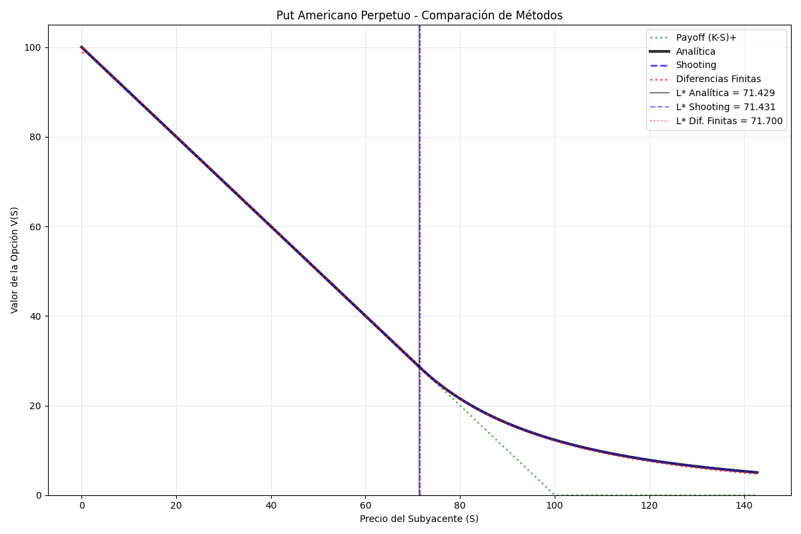

# Trabajo práctico 2 - Nicolás Baranowski

## Ejercicio 1 - Validación Analítica

**Objetivo.** Encontrar el valor de un **put americano perpetuo**.

#### Ecuación de Black–Scholes (PDE)

$$
\frac{\partial V}{\partial t}
+\frac12\,\sigma^2 S^2\,\frac{\partial^2 V}{\partial S^2}
+rS\,\frac{\partial V}{\partial S}
-rV \;=\;0.
$$

En el caso perpetuo, esta ecuación se transforma en una ODE ya que no depende del tiempo.

$$
\frac12\,\sigma^2 S^2\,V''(S)+rS\,V'(S)-rV(S)=0.
$$

La solución propuesta es la siguiente función:

$$
V_{L^*}(S)=
\begin{cases}
K-S, & 0<S\le L^*,\\[8pt]
\displaystyle \frac{K\sigma^2}{2r+\sigma^2}
\left(\frac{2r+\sigma^2}{2r}\,\frac{S}{K}\right)^{-\frac{2r}{\sigma^2}}, 
& S\ge L^*,
\end{cases}
\qquad
L^*=\frac{2r}{2r+\sigma^2}\,K.
$$

Ahora, queremos comprobar que es realmente una solución al problema.
Comenzamos buscando las derivadas $V'(S)$ y $V''(S)$ en la región de **continuación** 

**Definiciones para simplificar notación:**

$$
\alpha:=\frac{2r}{\sigma^2},\qquad
A:=\frac{K\sigma^2}{2r+\sigma^2},\qquad
c:=\frac{2r+\sigma^2}{2rK}.
$$

Entonces

$$
V(S)=A\,(cS)^{-\alpha}=A\,c^{-\alpha}\,S^{-\alpha}.
$$

### Primera derivada

Regla de la potencia:

$$
\frac{d}{dS}\,S^{-\alpha}=-\alpha\,S^{-\alpha-1}.
$$

Aplicando constantes:

$$
\boxed{\,V'(S)=-\alpha\,A\,c^{-\alpha}\,S^{-\alpha-1}\,}.
$$

Equivalente: $V'(S)=-\alpha\,\dfrac{V(S)}{S}$.

### Segunda derivada

Partiendo de $V'(S)=-\alpha\,V(S)\,S^{-1}$:

$$
\begin{aligned}
V''(S)
&=\frac{d}{dS}\big[-\alpha\,V(S)\,S^{-1}\big]\\
&=-\alpha\Big(V'(S)\,S^{-1}\;-\;V(S)\,S^{-2}\Big).
\end{aligned}
$$

Sustituyendo $V'(S)=-\alpha\,V(S)\,S^{-1}$:

$$
\begin{aligned}
V''(S)
&=-\alpha\Big[(-\alpha\,V(S)\,S^{-1})\,S^{-1}-V(S)\,S^{-2}\Big]\\[2pt]
&=-\alpha\Big[-\alpha\,V(S)\,S^{-2}-V(S)\,S^{-2}\Big]\\
&=\alpha(\alpha+1)\,V(S)\,S^{-2}.
\end{aligned}
$$

$$
\boxed{\,V''(S)=\alpha(\alpha+1)\,\dfrac{V(S)}{S^{2}}\,},\qquad \alpha=\frac{2r}{\sigma^{2}}.
$$


### Sustituimos en la ODE para comprobar si es solución:

Sustituyo $V'(S)$ y $V''(S)$ en
$\frac12\sigma^2 S^2V''+rSV'-rV$:

$$
\begin{aligned}
&=\frac12\sigma^2 S^2V''+rSV'-rV\\
&=\frac12\sigma^2 S^2\Big[\alpha(\alpha+1)A c^{-\alpha}S^{-\alpha-2}\Big]
+rS\Big[-\alpha A c^{-\alpha}S^{-\alpha-1}\Big]
-r\Big[A c^{-\alpha}S^{-\alpha}\Big]\\[4pt]
&=A c^{-\alpha}S^{-\alpha}\Big[\tfrac12\sigma^2\,\alpha(\alpha+1)-r\alpha-r\Big].
\end{aligned}
$$

Resolvemos $\alpha=\dfrac{2r}{\sigma^2}$ dentro del corchete y simplificamos:

$$
\begin{aligned}
&=\tfrac12\sigma^2\,\alpha(\alpha+1)-r\alpha-r\\
&=\tfrac12\sigma^2\Big(\tfrac{2r}{\sigma^2}\Big)\Big(\tfrac{2r}{\sigma^2}+1\Big)
-r\Big(\tfrac{2r}{\sigma^2}\Big)-r\\[4pt]
&=\underbrace{\Big(\tfrac12\sigma^2\cdot \tfrac{2r}{\sigma^2}\Big)}_{=\,r}
\Big(\tfrac{2r}{\sigma^2}+1\Big)
-\tfrac{2r^2}{\sigma^2}-r\\[4pt]
&=r\Big(\tfrac{2r}{\sigma^2}\Big)+r-\tfrac{2r^2}{\sigma^2}-r\\
&=\cancel{\tfrac{2r^2}{\sigma^2}}+\cancel{r}-\cancel{\tfrac{2r^2}{\sigma^2}}-\cancel{r}
=0.
\end{aligned}
$$

Por lo tanto,

$$
\boxed{\;\frac12\sigma^2 S^2V''+rSV'-rV=0\;}
$$

La **función partida** verifica la ecuación de Black–Scholes en la región de continuación. En $S\le L^*$, $V(S)=K-S$ (ejercicio inmediato) y la ODE no aplica.

### Por último, comprobamos que las condiciones de frontera se cumplen:

#### Coincidencia de valor: $V(L^*)=K-L^*$

$$
V(S)=\frac{K\sigma^2}{2r+\sigma^2}\left(\frac{2r+\sigma^2}{2r}\,\frac{S}{K}\right)^{-\frac{2r}{\sigma^2}},
\qquad
L^*=\frac{2r}{2r+\sigma^2}K.
$$

$$
\begin{aligned}
V(L^*)
&=\frac{K\sigma^2}{2r+\sigma^2}
\left(\frac{2r+\sigma^2}{2r}\,\frac{L^*}{K}\right)^{-\frac{2r}{\sigma^2}}\\[6pt]
&=\frac{K\sigma^2}{2r+\sigma^2}
\left(\frac{2r+\sigma^2}{2r}\,\frac{\tfrac{2r}{2r+\sigma^2}K}{K}\right)^{-\frac{2r}{\sigma^2}}\\[6pt]
&=\frac{K\sigma^2}{2r+\sigma^2}
\left(\frac{2r+\sigma^2}{2r}\cdot\frac{2r}{2r+\sigma^2}\right)^{-\frac{2r}{\sigma^2}}\\[6pt]
&=\frac{K\sigma^2}{2r+\sigma^2}\,(1)^{-\frac{2r}{\sigma^2}}\\
&=\frac{K\sigma^2}{2r+\sigma^2}.
\end{aligned}
$$

**Comprobación “value matching”:**
$$
\begin{aligned}
&= K-L^* \\
&=\; K-\frac{2r}{2r+\sigma^2}K \\
&=K\left(\frac{2r+\sigma^2-2r}{2r+\sigma^2}\right)\\
&\boxed{ 
\frac{K\sigma^2}{2r+\sigma^2}
=V(L^*)}.
\end{aligned}
$$
Esto quiere decir que $V(L^*)=K-L^*$ se cumple. 

#### Smooth Pasting: $V'(L^*)=-1$

Partiendo de la identidad válida en continuación:

$$
V'(S)=-\alpha\,\frac{V(S)}{S},\qquad \alpha=\frac{2r}{\sigma^2}.
$$

Evaluamos en $S=L^*$ y uso $V(L^*)=K-L^*$:

$$
V'(L^*)=-\alpha\,\frac{V(L^*)}{L^*}
=-\alpha\,\frac{K-L^*}{L^*}.
$$

Escribo $L^*=\dfrac{\alpha}{1+\alpha}K\Rightarrow K-L^*=\dfrac{1}{1+\alpha}K$. Entonces

$$
\frac{K-L^*}{L^*}
=\frac{\tfrac{1}{1+\alpha}K}{\tfrac{\alpha}{1+\alpha}K}
=\frac{1}{\alpha}.
$$

Sustituyendo:

$$
\boxed{\,V'(L^*)=-\alpha\cdot\frac{1}{\alpha}=-1\,}.
$$

#### Límite al infinito: $\displaystyle \lim_{S\to\infty}V(S)=0$

En continuación,

$$
V(S)=\frac{K\sigma^2}{2r+\sigma^2}
\left(\frac{2r+\sigma^2}{2r}\frac{S}{K}\right)^{-\frac{2r}{\sigma^2}}
= \underbrace{\frac{K\sigma^2}{2r+\sigma^2}
\left(\frac{2r+\sigma^2}{2rK}\right)^{-\alpha}}_{C>0}\; S^{-\alpha},
$$

con $\alpha=\dfrac{2r}{\sigma^2}>0$.

Como $C$ es constante positiva y $S^{-\alpha}$ tiende a 0 cuando  cuando $\alpha>0$,

$$
\boxed{\;\lim_{S\to\infty}V(S)=C\cdot \lim_{S\to\infty} S^{-\alpha}=0\; }.
$$

#### Cota inferior: $\displaystyle V(s) \ge (K-S)^+$

Convexidad en continuación $S\ge L^*$:

$$
V''(S)=\alpha(\alpha+1)\frac{V(S)}{S^2}>0
\quad(\alpha=\tfrac{2r}{\sigma^2}>0,\ V(S)>0),
$$

luego $V$ es **convexa** en $[L^*,\infty)$.

Recta tangente en $L^*$ por value matching y smooth pasting:

$$
V(L^*)=K-L^*,\qquad V'(L^*)=-1.
$$

La **tangente** en $L^*$ es

$$
T(S)=V(L^*)+V'(L^*)(S-L^*)=(K-L^*)-1\cdot(S-L^*)=K-S.
$$

Una función convexa queda **por encima** de su tangente en cualquier punto del dominio de convexidad:

$$
V(S)\ \ge\ T(S)=K-S,\qquad \forall\, S\ge L^*.
$$

Además, en la región de ejercicio tenemos que si $S\le L^*$: $V(S)=K-S=(K-S)^+$.

**Conclusión:**

$$
\boxed{\,V(S)\ \ge\ (K-S)^+\ \ \text{para todo }S>0\,}.
$$


## Ejercicio 2 - Shooting Method 

### Objetivo  
Resolver numéricamente el problema usando el método de shooting, tratándolo como un problema de valor inicial iterativo.

### Idea del Método
El **shooting method** convierte el problema de valor de frontera en múltiples problemas de valor inicial:

1. **Adivinar** un valor de $L$
2. **Disparar**: integrar la ODE desde $S=L$ hasta $S=S_{max}$ con condiciones iniciales:
   - $V(L) = K - L$ (value matching)
   - $V'(L) = -1$ (smooth pasting)
3. **Verificar**: ¿es $V(S_{max}) \approx 0$?
4. **Ajustar**: usar bisección para encontrar el $L$ correcto

### Implementación

```python
class Shooting:
    def __init__(self, K=100, r=0.05, sigma=0.2):
        self.K = K
        self.r = r  
        self.sigma = sigma
        self.L_star_teorico = (2 * self.r / (2 * self.r + self.sigma**2)) * self.K
    
    def ode_system(self, S, y):
        """Convierte ODE de 2° orden en sistema de 1° orden"""
        V, V_prime = y
        if S <= 1e-10:
            return np.array([V_prime, 0])
        
        V_double_prime = (self.r * V - self.r * S * V_prime) / (0.5 * self.sigma**2 * S**2)
        return np.array([V_prime, V_double_prime])
    
    def shoot_from_L(self, L, S_max=1000, h=0.1):
        """Integra la ODE desde L hasta S_max"""
        y0 = np.array([self.K - L, -1])  # Condiciones iniciales
        S_vals, y_vals = self.runge_kutta_4(self.ode_system, [L, S_max], y0, h)
        return S_vals, y_vals[0], y_vals[1]  # S, V(S), V'(S)
    
    def boundary_condition_error(self, L):
        """Función objetivo: queremos V(S_max) ≈ 0"""
        S_vals, V_vals, _ = self.shoot_from_L(L)
        return V_vals[-1]  # Error = V en el punto más lejano
```

### Proceso de Ejecución
```python
# Crear solver y buscar L óptimo
shooting = Shooting(K=100, r=0.05, sigma=0.2)
L_optimal = shooting.find_optimal_L()

# Validar solución
shooting.validate_solution(L_optimal)
```

**Ventajas**:
- Convierte problema complejo en múltiples problemas simples
- Muy preciso para ODEs  
- Robusto ante diferentes condiciones iniciales

**Desventajas**:
- Necesita adivinar el valor de $L^*$
- Puede ser inestable para problemas inestables

---

## Ejercicio 3 - Método de Diferencias Finitas 

### Objetivo
Resolver el problema discretizando el dominio completo y usando diferencias finitas con penalización.

### Idea del Método
En lugar de "disparar", **discretizamos todo el dominio** $[0, S_{max}]$ en una grilla y resolvemos simultáneamente:

1. **Discretizar**: $S_i = i \cdot h$, donde $h = S_{max}/N$
2. **Aproximar derivadas**:
   - $V'_i \approx \frac{V_{i+1} - V_{i-1}}{2h}$ 
   - $V''_i \approx \frac{V_{i-1} - 2V_i + V_{i+1}}{h^2}$
3. **Penalizar restricciones**: Agregar $\lambda \max\{0, K-S-V\}$ para manejar $V \geq K-S$
4. **Resolver sistema**: $AV = b$ con relajación iterativa

### Implementación con Relajación 

```python
class FiniteDifferences:
    def solve(self, S_max=120, N=2000, epsilon=1e-6, tol=1e-6, max_iter=2000, rho=0.1):
        dx = S_max / N
        grid = np.linspace(0, S_max, N+1)
        u = np.maximum(self.K - grid, 0.0)  # Inicializar con payoff
        
        for k in range(max_iter):
            u_prev = u.copy()
            
            # Armar sistema lineal Mu = f
            M = np.zeros((N+1, N+1))
            f = np.zeros(N+1)
            
            # Condiciones de borde
            M[0, 0] = 1; f[0] = self.K      # V(0) = K
            M[N, N] = 1; f[N] = 0           # V(S_max) = 0
            
            # Nodos internos
            for j in range(1, N):
                S_j = grid[j]
                if self.K - S_j > u[j] + epsilon:
                    # Región de ejercicio: V = K - S
                    M[j, j] = 1
                    f[j] = self.K - S_j
                else:
                    # Región de continuación: aplicar ODE discretizada
                    sigma2_S2 = self.sigma**2 * S_j**2
                    r_S = self.r * S_j
                    
                    M[j, j-1] = 0.5 * sigma2_S2 / dx**2 - 0.5 * r_S / dx
                    M[j, j] = -(sigma2_S2 / dx**2 + self.r)
                    M[j, j+1] = 0.5 * sigma2_S2 / dx**2 + 0.5 * r_S / dx
                    f[j] = 0
            
            # RELAJACIÓN 
            u_new = np.linalg.solve(M, f)
            u = (1 - rho) * u_prev + rho * u_new  # u = θu_new + (1-θ)u_old
            
            if np.linalg.norm(u - u_prev, np.inf) < tol:
                break
```

### Proceso de Ejecución
```python
# Crear solver y resolver con relajación
fd = FiniteDifferences(K=100, r=0.05, sigma=0.2)
results = fd.solve(S_max=300, N=2000, rho=0.1)  # rho = parámetro de relajación
```

**Importancia de la Relajación**:
Sin relajación ($\rho=1$) el método puede oscilar y no converger. La relajación $V_{new} = \rho \cdot V_{target} + (1-\rho) \cdot V_{old}$ suaviza los cambios entre iteraciones, garantizando convergencia estable.

**Ventajas**:
- No necesita adivinar $L^*$ (emerge naturalmente)
- Maneja restricciones de desigualdad directamente
- Solución global simultánea

**Desventajas**:
- Requiere grilla fina para precisión
- Más intensivo computacionalmente
- Puede no converger si los parámetros no están bien ajustados

---

## Comparación y Análisis 

### Resultados Obtenidos

Para los parámetros $K=100$, $r=0.05$, $\sigma=0.2$:

| Método               | L*           | Error (%)  |
|---------------------|--------------|------------|
| Analítico           | 71.428571    | 0.000      |
| Shooting            | 71.430925    | 0.003      |
| Diferencias Finitas | 71.700000    | 0.380      |

### Análisis Visual



La gráfica muestra:

1. **Región de Ejercicio** ($S \leq L^*$): Todas las soluciones coinciden con $V(S) = K - S$
2. **Región de Continuación** ($S > L^*$): 
   - **Analítica** y **Shooting** prácticamente idénticas
   - **Diferencias Finitas** muestra pequeñas diferencias debido a la discretización
3. **Frontera de Ejercicio**: Los tres métodos identifican $L^*$ 

### Análisis de Precisión

**Shooting Method**:
- Error relativo: 0.003%
- Excelente precisión debido a integración continua
- Limitado por tolerancia de bisección y paso de RK4

**Diferencias Finitas**:
- Error relativo: 0.380% 
- Precisión limitada por espaciado de grilla ($h = S_{max}/N$)
- Mejora con grillas más finas, pero aumenta costo computacional

### Robustez y Sensibilidad

**Shooting**:
- Sensible a condiciones iniciales problemáticas
- Puede fallar si $L^*$ está fuera del rango de búsqueda
- Excelente para problemas bien condicionados

**Diferencias Finitas**:
- Más robusto ante diferentes parámetros
- La relajación evita problemas de convergencia
- Maneja naturalmente restricciones complejas

---

### Parámetros 

**Shooting Method**:
```python
L_min = 0.1 * K     # Rango de búsqueda inferior
L_max = 0.9 * K     # Rango de búsqueda superior  
h = 0.1             # Paso de integración RK4
tol = 1e-6          # Tolerancia de bisección
```

**Diferencias Finitas**:
```python
N = 2000           # Puntos de grilla (más = mayor precisión)
rho = 0.1          # Relajación (0.1-0.3 recomendado)
epsilon = 1e-6     # Tolerancia para identificar ejercicio
max_iter = 2000    # Iteraciones máximas
```

### Recomendaciones de Uso

- **Para máxima precisión**: Usar **Shooting Method**
- **Para robustez y casos complejos**: Usar **Diferencias Finitas con relajación**

### Limitaciones

**Shooting Method**:
- Requiere rango de búsqueda apropiado para $L^*$
- Puede fallar si ODE es stiff

**Diferencias Finitas**:
- Precisión limitada por discretización
- Requiere relajación para convergencia
- Mayor costo computacional con grillas finas

**Ejecución**:
```python
# Comparar todos los métodos
resultados = comparar_metodos(K=100, r=0.05, sigma=0.2)
graficar_comparacion(resultados)
```

El análisis confirma que ambos métodos numéricos convergen correctamente a la solución analítica, con el shooting method ofreciendo mayor precisión y las diferencias finitas mayor robustez.